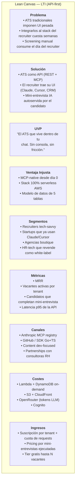
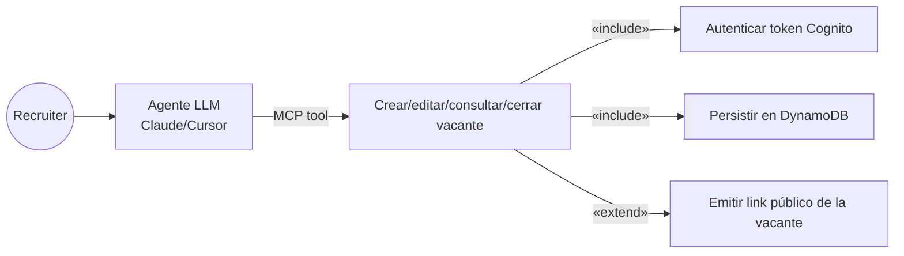
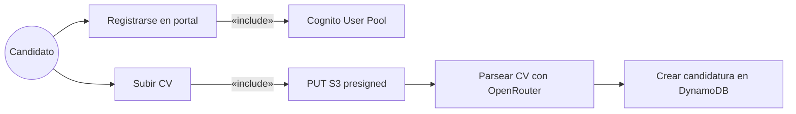
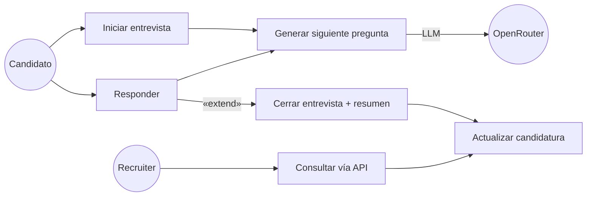
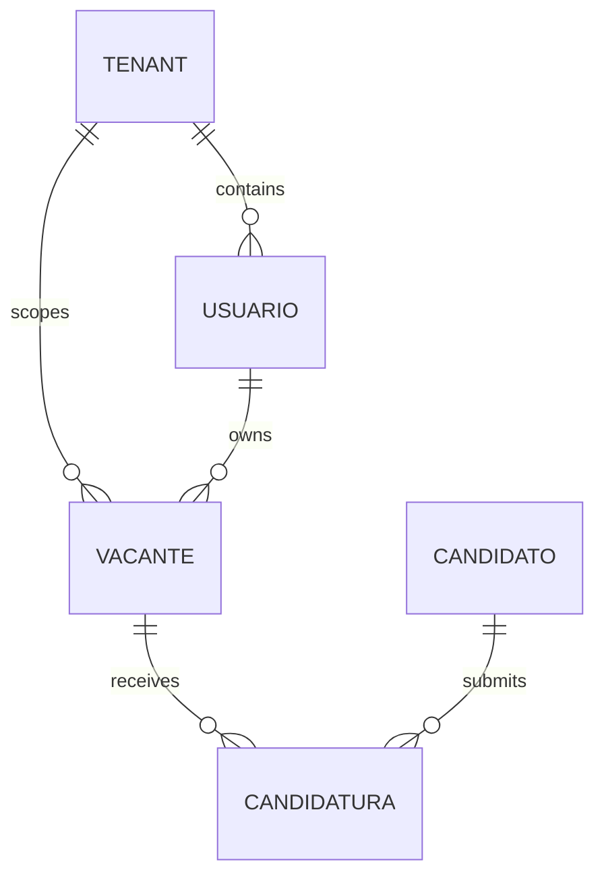
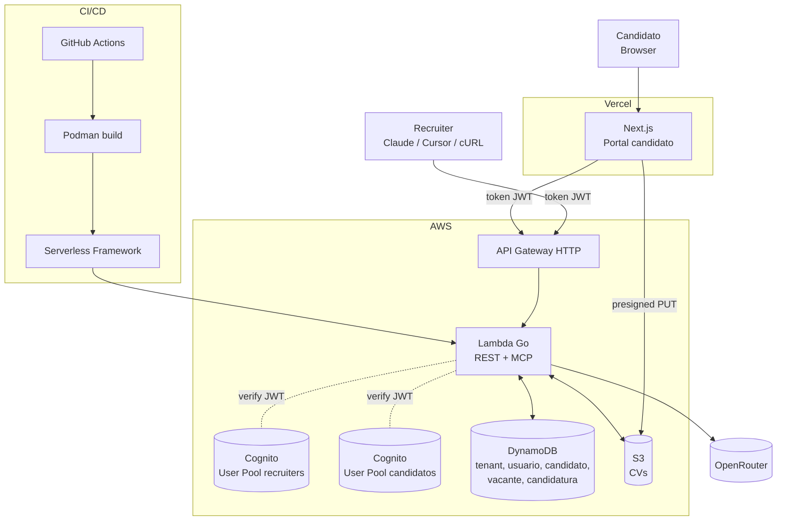
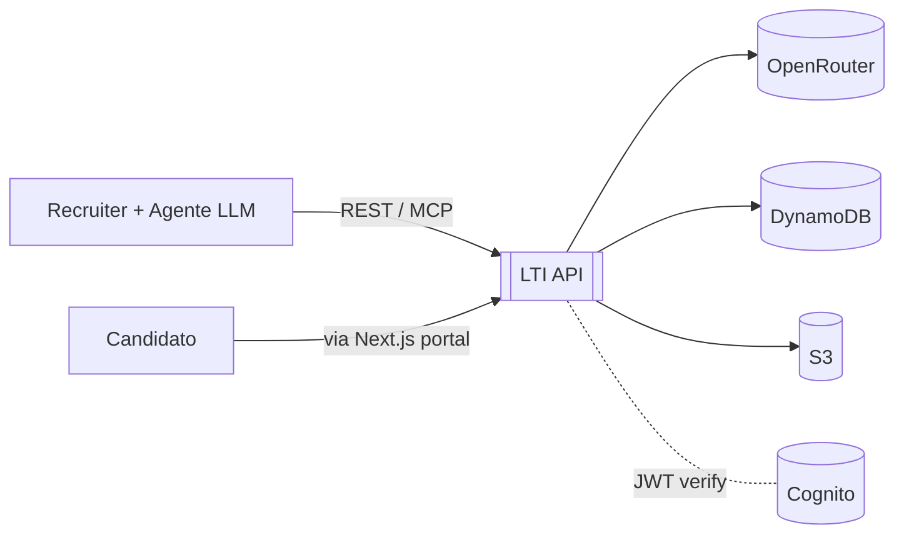
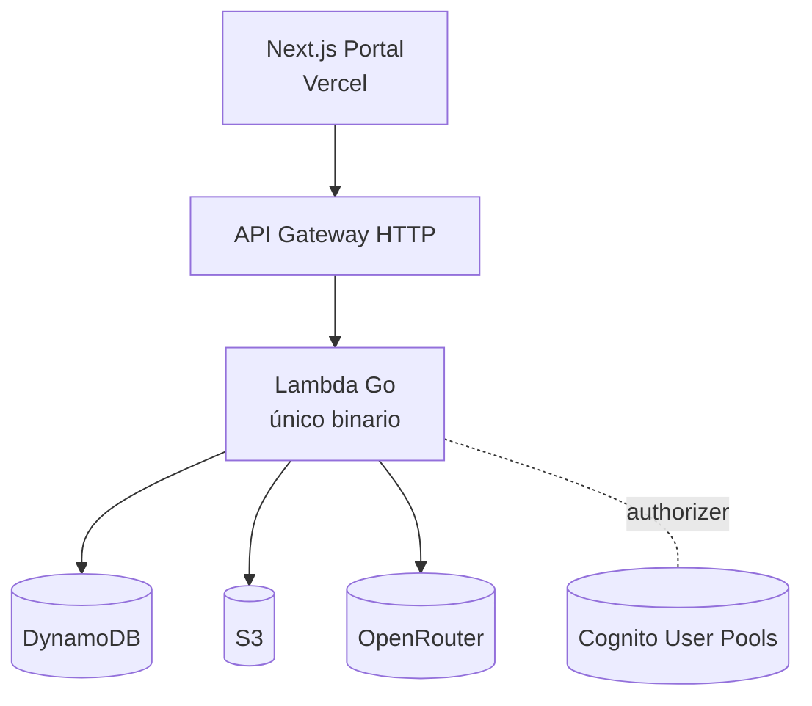
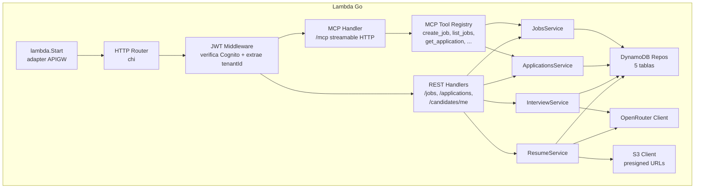
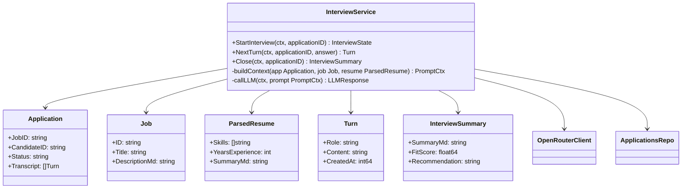

# LTI — ATS Minimalista *API-first*

> Autor: Aldrin Leal (AL) · Fecha: 2026-04-13
> Filosofía: **AWS-style**. Un producto = una API. Sin consola propia. Los clientes (recruiters) traen su propia UI vía MCP o REST.

---

## 1. Descripción del producto

**LTI** es un ATS (Applicant Tracking System) entregado como **API pura**. No hay panel de administración: los recruiters lo consumen desde su herramienta favorita (Claude Desktop, Cursor, scripts, su propio CRM) a través de **MCP** o **REST**, autenticándose con un *token de usuario* que transporta implícitamente el `tenantId`.

Los **candidatos** son el único actor con una UI visible: un enlace web público donde se registran, suben su CV, y completan una **mini-entrevista asistida por IA**.

### 1.1 Valor añadido

- **Time-to-integrate ≈ 0**: con MCP, un recruiter conecta Claude/Cursor a LTI en minutos y empieza a crear vacantes por chat.
- **Sin UI que mantener** → menor time-to-market, menor costo, menor superficie de bugs.
- **Mini-entrevista IA** automatizada vía OpenRouter: reduce screening manual sin UI dedicada.
- **Pay-per-use friendly**: stack 100% serverless (Lambda + DynamoDB on-demand + S3), costo ≈ 0 cuando no hay tráfico.

### 1.2 Ventajas competitivas

| Ventaja | Descripción |
|---|---|
| **API-first, AWS-style** | Un contrato REST + MCP; sin lock-in de UI. |
| **MCP-native** | Primer ATS consumible directamente desde agentes LLM. |
| **Minimalismo radical** | 5 entidades, 5 tablas DynamoDB, 1 Lambda Go. |
| **Serverless end-to-end** | Escala a cero; costo proporcional al uso real. |
| **Candidate-centric UI** | La única UI existe para el candidato, no para el recruiter. |

### 1.3 Funciones principales

1. **Gestión de vacantes** (crear / editar / consultar / cerrar) vía API.
2. **Portal público del candidato** (Next.js) para registro + upload de CV.
3. **Parsing de CV** (S3 → Lambda → OpenRouter).
4. **Mini-entrevista IA** conversacional en el portal del candidato.
5. **Gestión de candidaturas** (listar, consultar estado, cambiar estado) vía API.
6. **Auth por tokens** emitidos desde Cognito; el `tenantId` va embebido en el claim.
7. **MCP server** que expone las operaciones anteriores como herramientas a agentes LLM.

---

## 2. Lean Canvas

---

## 3. Casos de uso principales

### 3.1 UC-01 — Recruiter gestiona una vacante desde su agente MCP

**Actor**: Recruiter (vía Claude Desktop / Cursor / cURL). Token Cognito transporta `tenantId` y `sub`.

**Flujo**: el recruiter le dice a su agente "crea una vacante de Go Senior remoto". El agente invoca la herramienta MCP `create_job`, que golpea `POST /jobs` en la Lambda, que persiste en DynamoDB. Consultas, ediciones y cierre siguen el mismo camino (`GET`, `PATCH`, `POST /jobs/{id}/close`).

### 3.2 UC-02 — Candidato se postula y sube su CV

**Actor principal**: Candidato. **Secundarios**: Cognito, S3, OpenRouter.

**Flujo**: el candidato abre el link público de la vacante (Next.js en Vercel), se registra (Cognito User Pool de candidatos), sube su CV a S3 vía presigned URL. La Lambda extrae texto, pide a OpenRouter un resumen estructurado, y crea una `candidatura` vinculada a la `vacante` y al `candidato`.

### 3.3 UC-03 — Mini-entrevista IA asíncrona

**Actor principal**: Candidato. **Secundarios**: OpenRouter, Lambda.

**Flujo**: tras la postulación, el portal lanza una mini-entrevista conversacional (5–7 preguntas). Cada turno hace `POST /applications/{id}/interview/turn`; la Lambda usa el CV parseado + la JD como contexto y OpenRouter genera la siguiente pregunta. Al cerrar, el sistema guarda un resumen + score en la candidatura, que el recruiter consume vía `GET /applications/{id}` desde su agente.

---

## 4. Modelo de datos

**5 tablas DynamoDB**. Claves diseñadas para consultas por tenant y por entidad; sin GSIs innecesarios.

### 4.1 Entidades y atributos

| Entidad | Atributo | Tipo | Nota |
|---|---|---|---|
| **tenant** | PK `tenantId`, `name`, `plan`, `webhooks`, `integrations`, `createdAt` | string, string, string `free\|pro\|enterprise`, list<map{event,url,secret}>, map<string,map>, number | `webhooks`: lista opcional de endpoints para eventos (`application.created`, `interview.closed`, `job.closed`, …). `integrations`: config opcional por proveedor (`slack`, `greenhouse`, `workable`, …) con claves cifradas via KMS. |
| **usuario** (recruiter) | PK `tenantId#userId`, `cognitoSub`, `email`, `name`, `createdAt` | string, string, string, string, number (epoch) | `cognitoSub` también como atributo para lookup inverso. |
| **candidato** | PK `candidateId`, `cognitoSub`, `email`, `fullName`, `resumeS3Key`, `resumeParsedJson`, `createdAt` | string, string, string, string, string, map, number | User pool de candidatos separado del de recruiters. |
| **vacante** | PK `tenantId`, SK `jobId`, `title`, `descriptionMd`, `status`, `publicSlug`, `createdAt`, `closedAt` | string, string, string, string, string `open\|closed`, string, number, number | Query *list jobs by tenant* → PK = tenantId. |
| **candidatura** | PK `jobId`, SK `candidateId`, `tenantId`, `status`, `interviewTranscript`, `interviewSummary`, `fitScore`, `createdAt`, `updatedAt` | string, string, string, string `applied\|interviewing\|reviewed\|rejected\|hired`, list<map>, string, number, number, number | GSI1 PK=`candidateId` para "mis aplicaciones". |

Los **webhooks** son opcionales y best-effort: tras cada evento relevante la Lambda dispara un `POST` firmado con HMAC (secreto del tenant) al endpoint registrado. Fallos se reintentan con backoff exponencial hasta N veces; no hay cola dedicada (se usa `SQS` sólo si un tenant supera el umbral, fuera del v1).

### 4.2 Diagrama de relaciones (lógicas, no FKs)

---

## 5. Diseño del sistema a alto nivel

### 5.1 Descripción

Todo es **serverless en AWS**. Una única **Lambda Go** (función monolítica con router HTTP) sirve tanto la **REST API** como el **MCP server** (detecta el path). **API Gateway HTTP API** la expone. La autenticación la hace **Cognito** (dos user pools: `recruiters` y `candidates`); los tokens JWT llevan `custom:tenantId` en sus claims, que el handler lee para aislar datos.

**DynamoDB** guarda las 5 tablas; **S3** guarda los CVs crudos. **OpenRouter** es el proveedor LLM para parseo de CV y mini-entrevista.

El **portal del candidato** es una app **Next.js desplegada en Vercel**, que habla directamente con la API (con token del candidato) y con S3 (presigned URLs).

**Deploy**: **Serverless Framework** desde **GitHub Actions**, con build del binario Go empaquetado en un contenedor **Podman** para imagen Lambda reproducible.

### 5.2 Diagrama de alto nivel

### 5.3 Decisiones clave

- **Una sola Lambda** (no microservicios): minimiza cold starts, deploy y complejidad. Go la hace viable por su arranque rápido.
- **MCP y REST en el mismo binario**: el MCP es un *thin wrapper* sobre los mismos handlers REST.
- **Sin consola propia**: elimina ~70% del scope inicial de un ATS.
- **Dos user pools Cognito**: aísla el espacio de identidades de recruiters y candidatos; cada token sabe a qué pool pertenece.
- **`tenantId` en el token**, no como parámetro: imposible consultar datos de otro tenant aunque se fuerce la URL.

---

## 6. Diagrama C4 — zoom en la **Lambda Go (API + MCP)**

### 6.1 C1 — Contexto

### 6.2 C2 — Contenedores

### 6.3 C3 — Componentes internos de la Lambda Go

### 6.4 C4 — Código del componente **InterviewService**

**Responsabilidades del `InterviewService`:**

- Orquesta la conversación turno a turno; cada turno es una invocación REST idempotente (el estado vive en DynamoDB, no en memoria).
- Construye el *prompt* combinando JD + resumen del CV + historial truncado para controlar coste de tokens.
- Al cerrar, pide al LLM un **resumen estructurado** (`summaryMd`, `fitScore`, `recommendation`) que queda accesible al recruiter vía `GET /applications/{id}` y vía la MCP tool `get_application`.

---

## 7. Out of scope (v1)

- Panel web de administración para recruiters.
- Kanban colaborativo / realtime.
- Integración con job boards externos.
- Calendar scheduling.
- Scorecards multi-entrevistador.

Todo lo anterior es *construible por el cliente* encima de la API si lo necesita.
