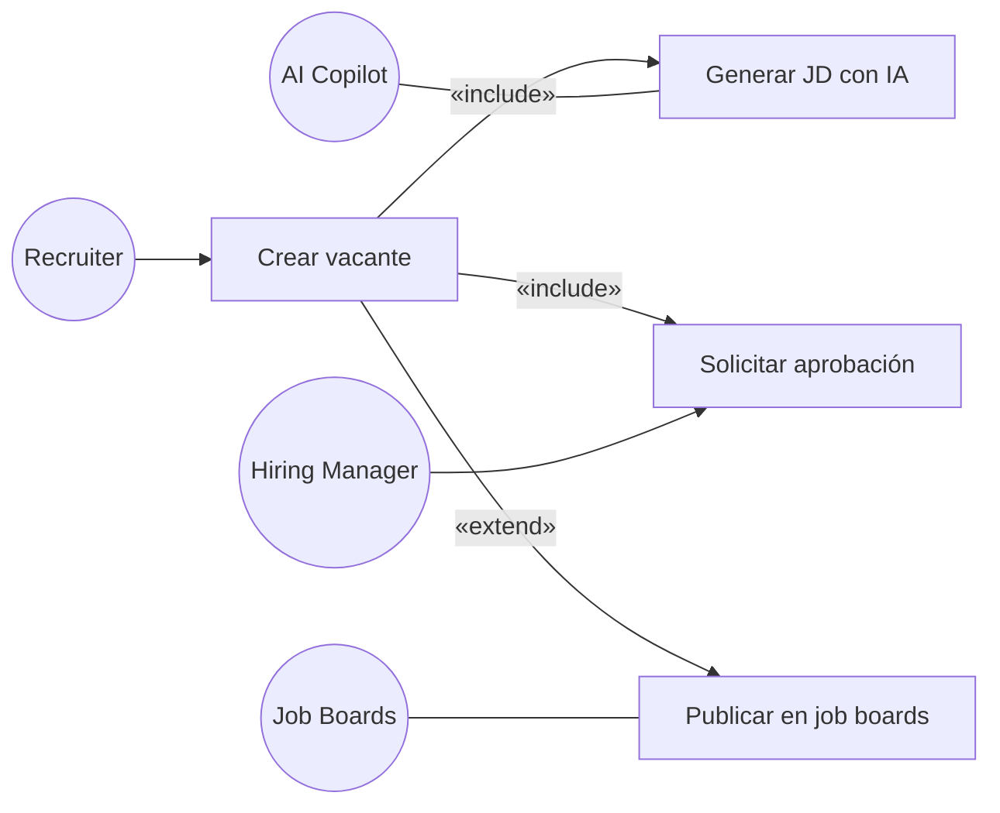
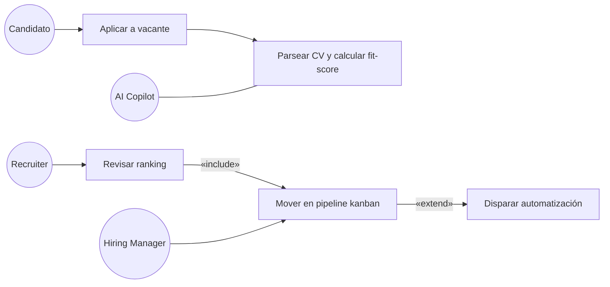
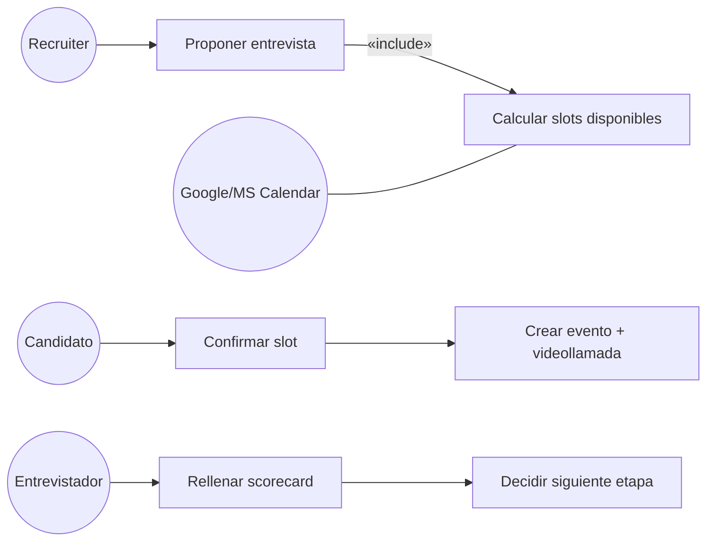
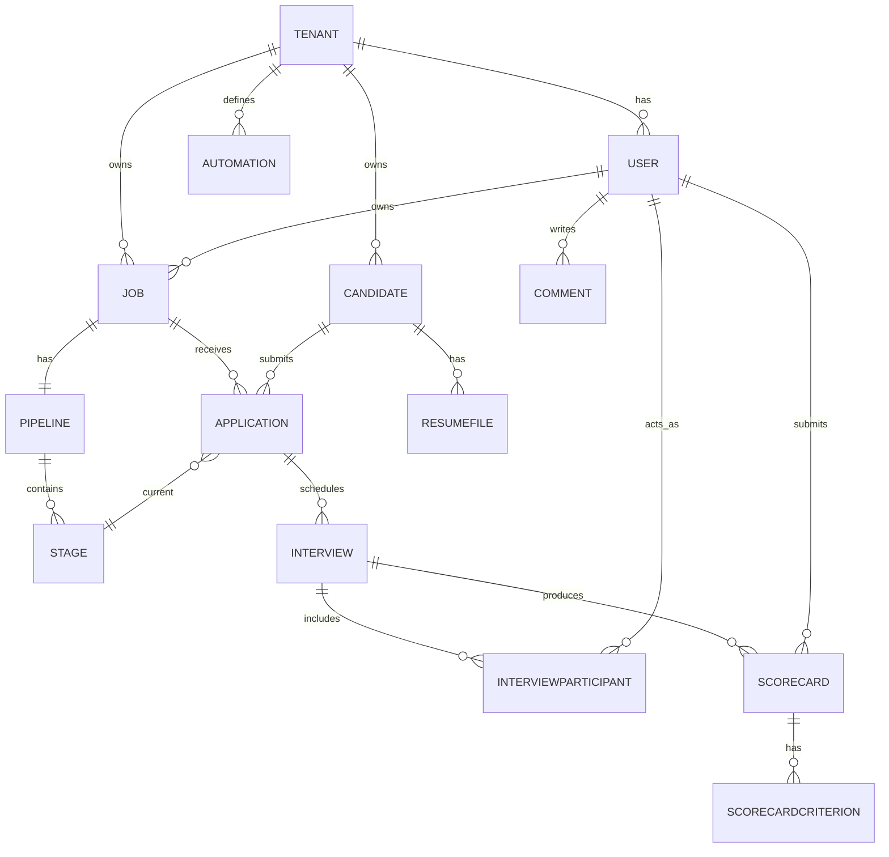
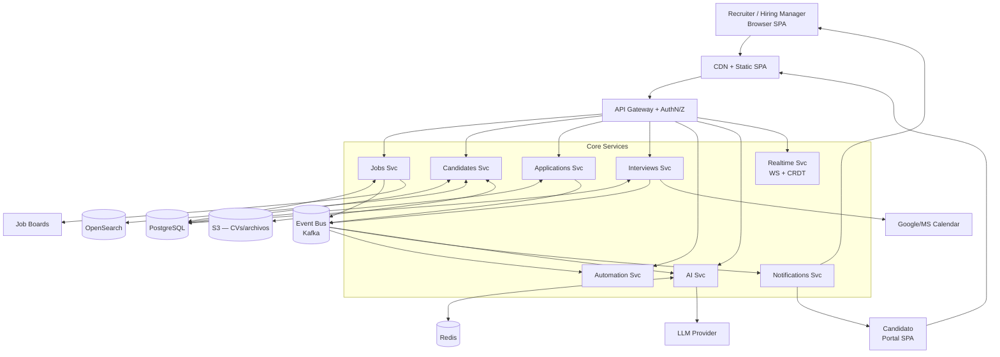
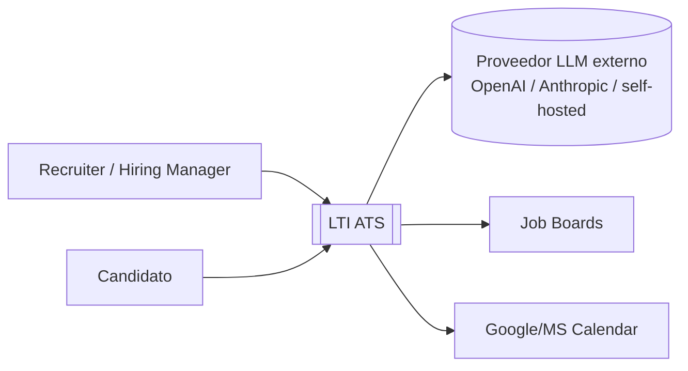
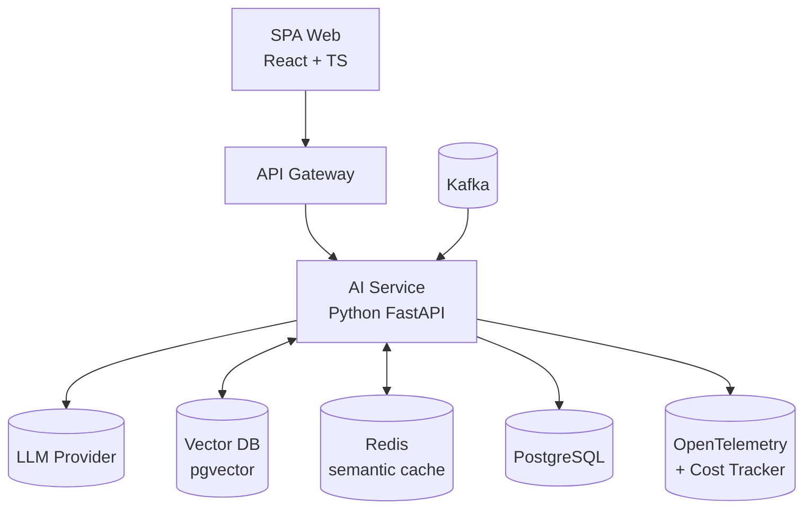
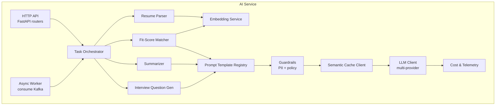
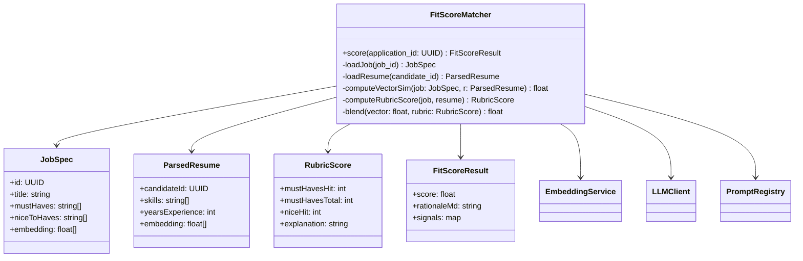

# LTI — Applicant Tracking System (ATS) of the Future

> Autor: Aldrin Leal (AL) · Fecha: 2026-04-13

---

## 1. Descripción del producto

**LTI** es un **Applicant Tracking System (ATS)** SaaS multi-tenant orientado a equipos de contratación modernos (startups escalando, scale-ups y áreas de Talent Acquisition de empresas medianas). Centraliza todo el ciclo de vida de la contratación —desde la apertura de la vacante hasta el onboarding— y se diferencia por una capa profunda de **IA generativa** y **colaboración en tiempo real** entre reclutadores, hiring managers y entrevistadores.

### 1.1 Valor añadido

- **Reducción del *time-to-hire*** mediante automatización del screening, *matching* semántico CV↔vacante y agendado autónomo de entrevistas.
- **Mejor calidad de contratación** gracias a scorecards estructurados, reducción de sesgo (anonimización opcional) y recomendaciones basadas en históricos.
- **Colaboración real-time** entre recruiter y hiring manager: kanban compartido, comentarios con menciones, presence awareness y notificaciones.
- **Experiencia del candidato premium**: portal propio, feedback automatizado y transparencia de estado.

### 1.2 Ventajas competitivas

| Ventaja | Descripción |
|---|---|
| **AI-native**, no *AI bolted-on* | Copiloto integrado en cada paso (redacción JD, resumen CV, preguntas sugeridas, score de fit). |
| **Colaboración tipo Figma/Notion** | Multi-cursor, comentarios anclados al candidato, @menciones, CRDT en scorecards. |
| **Automatizaciones *no-code*** | Editor visual de pipelines (tipo Zapier interno) sin salir del ATS. |
| **Data portability** | Exportación total, API pública y webhooks; evita *vendor lock-in*. |
| **Cumplimiento** GDPR / EEOC | Retención configurable, derecho al olvido, audit trail inmutable. |

### 1.3 Funciones principales

1. **Gestión de vacantes** (creación asistida por IA, aprobación, publicación multi-board).
2. **Sourcing & ingesta de candidatos** (parsing de CV, importación LinkedIn, referidos).
3. **Pipeline kanban colaborativo** con etapas configurables por vacante.
4. **Screening IA**: ranking de candidatos, resumen de CV, detección de red flags.
5. **Agendamiento de entrevistas** con integración Google/Microsoft Calendar.
6. **Scorecards estructurados** y evaluaciones colaborativas.
7. **Portal del candidato** con self-service y comunicación bidireccional.
8. **Automatizaciones**: triggers → acciones (email, Slack, mover etapa, rechazar, etc.).
9. **Analytics & reporting**: embudo, diversidad, fuente, costo por hire.
10. **API pública + webhooks** para integraciones (HRIS, background checks, assessments).

---

## 2. Lean Canvas

```mermaid
flowchart TB
  subgraph LC["Lean Canvas — LTI"]
    P["<b>Problema</b><br/>• ATS legados lentos y poco colaborativos<br/>• Screening manual consume 40% del tiempo del recruiter<br/>• Hiring managers sin visibilidad en tiempo real<br/>• Mala experiencia del candidato"]
    S["<b>Solución</b><br/>• ATS AI-native con copiloto integrado<br/>• Pipeline colaborativo real-time<br/>• Automatizaciones no-code<br/>• Portal del candidato premium"]
    UVP["<b>Propuesta Única de Valor</b><br/>&quot;El ATS que piensa contigo:<br/>contrata 2x más rápido sin perder el toque humano&quot;"]
    UA["<b>Ventaja Injusta</b><br/>• Modelos fine-tuned sobre datos anónimos de hiring<br/>• Arquitectura real-time (CRDT) desde día 0<br/>• Compliance GDPR/EEOC by design"]
    CS["<b>Segmentos de Cliente</b><br/>• Startups Series A–C (20–500 empleados)<br/>• Scale-ups tech en Europa/LatAm<br/>• Equipos TA de empresas medianas"]
    KM["<b>Métricas Clave</b><br/>• MRR y NRR<br/>• Time-to-hire promedio<br/>• % candidatos procesados por IA<br/>• NPS recruiter y candidato"]
    CH["<b>Canales</b><br/>• Product-led growth (free tier)<br/>• Comunidades de TA (LinkedIn, Slack)<br/>• Partnerships con job boards<br/>• Content SEO"]
    CST["<b>Estructura de Costes</b><br/>• Cloud (compute + GPU inferencia)<br/>• Personal Eng/Product<br/>• LLM API (o self-hosted)<br/>• Sales & Marketing"]
    RS["<b>Fuentes de Ingresos</b><br/>• SaaS por asiento (recruiter)<br/>• Tiers: Starter / Growth / Enterprise<br/>• Add-ons: IA avanzada, SSO, SLA"]
  end
```

---

## 3. Casos de uso principales

### 3.1 UC-01 — Publicar una vacante con asistencia IA

**Actor principal**: Recruiter · **Secundarios**: Hiring Manager (aprobador), motor IA, Job Boards.

**Flujo**: el recruiter abre una nueva vacante, describe el rol en lenguaje natural, la IA genera una Job Description estructurada, el hiring manager la revisa/aprueba, y el sistema publica simultáneamente en los job boards configurados.

### 3.2 UC-02 — Screening colaborativo y ranking de candidatos

**Actor principal**: Recruiter · **Secundarios**: Hiring Manager, motor IA.

**Flujo**: al llegar candidatos, la IA parsea el CV, calcula un fit-score contra la vacante y genera un resumen. El recruiter revisa el ranking, mueve candidatos en el pipeline kanban (con presencia en vivo del hiring manager) y dispara acciones automáticas (email, assessment).

### 3.3 UC-03 — Agendar entrevista y registrar scorecard

**Actor principal**: Recruiter · **Secundarios**: Candidato, Entrevistador, Calendario externo.

**Flujo**: el recruiter selecciona un candidato, el sistema propone *slots* cruzando las agendas, el candidato confirma vía portal, se genera evento + link de videollamada, y tras la entrevista los entrevistadores rellenan un scorecard estructurado que alimenta la decisión de la siguiente etapa.

---

## 4. Modelo de datos

### 4.1 Entidades y atributos

| Entidad | Atributo | Tipo |
|---|---|---|
| **Tenant** | id, name, plan, createdAt | UUID, string, enum, timestamp |
| **User** | id, tenantId, email, fullName, role, authProvider, createdAt | UUID, UUID, string, string, enum{admin,recruiter,hiring_manager,interviewer}, enum, timestamp |
| **Job** | id, tenantId, title, department, location, employmentType, descriptionMd, status, openedAt, closedAt, ownerUserId | UUID, UUID, string, string, string, enum, text, enum{draft,open,on_hold,closed}, timestamp, timestamp, UUID |
| **Pipeline** | id, jobId, name | UUID, UUID, string |
| **Stage** | id, pipelineId, name, order, type | UUID, UUID, string, int, enum{sourced,screen,interview,offer,hired,rejected} |
| **Candidate** | id, tenantId, fullName, email, phone, locationCity, linkedInUrl, resumeFileId, createdAt | UUID, UUID, string, string, string, string, string, UUID, timestamp |
| **Application** | id, jobId, candidateId, currentStageId, fitScore, source, status, appliedAt | UUID, UUID, UUID, UUID, float, string, enum{active,hired,rejected,withdrawn}, timestamp |
| **ResumeFile** | id, candidateId, storageUrl, parsedJson, contentHash | UUID, UUID, string, jsonb, string |
| **Interview** | id, applicationId, stageId, scheduledAt, durationMin, meetingUrl, status | UUID, UUID, UUID, timestamp, int, string, enum{scheduled,done,no_show,cancelled} |
| **InterviewParticipant** | interviewId, userId, role | UUID, UUID, enum{interviewer,observer} |
| **Scorecard** | id, interviewId, userId, overallRating, recommendation, submittedAt | UUID, UUID, UUID, int 1–5, enum{strong_hire,hire,no_hire,strong_no_hire}, timestamp |
| **ScorecardCriterion** | id, scorecardId, name, rating, notesMd | UUID, UUID, string, int, text |
| **Comment** | id, targetType, targetId, authorUserId, bodyMd, createdAt | UUID, enum, UUID, UUID, text, timestamp |
| **Automation** | id, tenantId, name, triggerJson, actionsJson, enabled | UUID, UUID, string, jsonb, jsonb, bool |
| **AuditLog** | id, tenantId, actorUserId, action, targetType, targetId, payloadJson, createdAt | UUID, UUID, UUID, string, string, UUID, jsonb, timestamp |

### 4.2 Diagrama entidad-relación

---

## 5. Diseño del sistema a alto nivel

### 5.1 Descripción

LTI sigue una arquitectura **multi-tenant cloud-native** desplegada en Kubernetes, con separación lógica por `tenantId`. El frontend es una SPA (React + TypeScript) servida por CDN. Una **API Gateway** enruta tráfico HTTPS a un conjunto de **microservicios** por dominio de negocio (Jobs, Candidates, Interviews, AI, Automation, Notifications). La persistencia principal es **PostgreSQL** (datos transaccionales) con **OpenSearch** para búsqueda textual y **S3** para archivos (CVs). Un **bus de eventos** (Kafka/NATS) conecta servicios de forma asíncrona y alimenta automatizaciones y analítica. Un servicio **Realtime** (WebSocket + CRDT) soporta la colaboración en vivo. El **AI Service** abstrae LLMs (proveedor cloud o self-hosted) con caché semántica para controlar costes.

### 5.2 Diagrama de alto nivel

### 5.3 Decisiones clave

- **Multi-tenant**: row-level security en PostgreSQL por `tenantId` + aislamiento de claves cifrado por tenant.
- **Async-first**: toda mutación relevante emite un evento; automatizaciones y búsqueda se construyen sobre el bus.
- **Realtime**: separado de la API REST para evitar acoplar presión de WebSockets al camino transaccional.
- **IA abstraída**: un único `AI Svc` desacopla al resto del proveedor LLM y centraliza *prompt templates*, caché y telemetría de coste.

---

## 6. Diagrama C4 — zoom en el **AI Service**

### 6.1 C1 — Contexto

### 6.2 C2 — Contenedores (recorte centrado en IA)

### 6.3 C3 — Componentes internos del **AI Service**

### 6.4 C4 — Código (zoom al componente **Fit-Score Matcher**)

**Responsabilidades clave del `FitScoreMatcher`:**

- Combina **similitud vectorial** (embedding JD ↔ CV) con una **rúbrica estructurada** (must-haves / nice-to-haves) para evitar el *black-box* puro.
- Devuelve un *rationale* en Markdown que el recruiter puede auditar y editar.
- Pasa todo prompt por **Guardrails** (anonimización PII opcional, filtros de sesgo) y **Semantic Cache** antes de invocar al LLM.
- Emite eventos `application.scored` al bus para que otros servicios (Notifications, Automation) reaccionen.

---

## 7. Próximos pasos

1. Validar UVP con 5 entrevistas a Heads of TA.
2. Prototipo clicable de UC-02 (screening colaborativo).
3. Definir *prompt eval harness* antes de escribir código de producción del AI Service.
4. Plan de cumplimiento GDPR + DPA templates.
